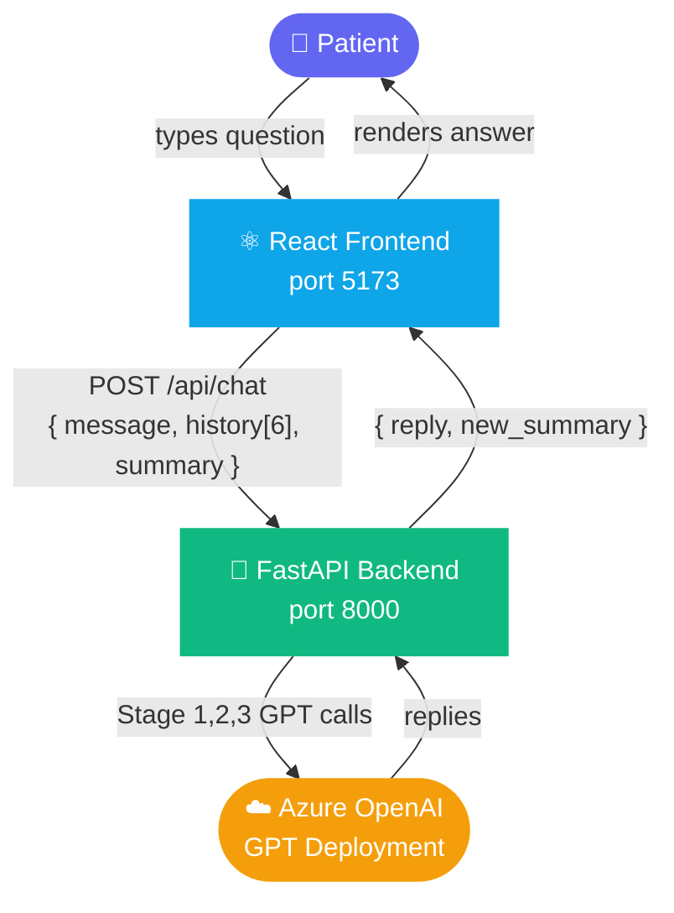
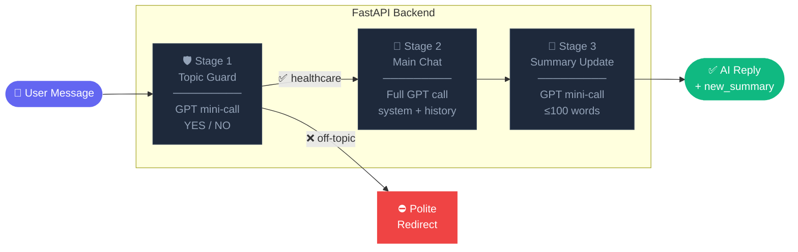
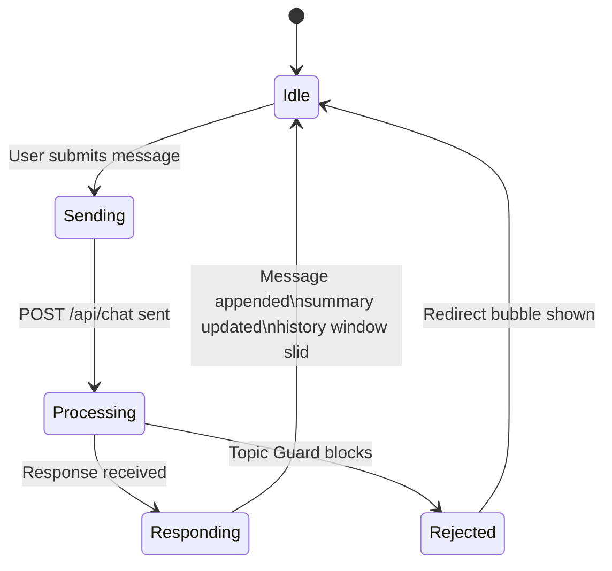

<div align="center">

# 🏥 Volo Health AI

**An agentic AI chatbot that helps patients prepare for hospitalisation.**

React · TypeScript · FastAPI · Azure OpenAI

[](LICENSE)


</div>

---

## 🎬 Demo

> Watch the full demo below:

https://github.com/AryanKadar/volo-health-ai/assets/demo/Demo_video.mp4

---

## ✨ Features

| Feature | Description |
|---|---|
| 💬 **Conversational AI** | Answers questions on admission, surgery prep, discharge & follow-ups |
| 🛡️ **Topic Guard** | Silently rejects off-topic questions before reaching the main model |
| 🧠 **Smart Context** | Keeps last 6 turns + rolling summary — handles infinite-length chats |
| ⚡ **Stateless Backend** | All session state lives in the frontend; backend is a pure function |
| 🎨 **Modern UI** | React 18 · Vite · Tailwind CSS · ShadCN UI Components |

---

## 🏗️ Architecture

### High-Level System Flow



### 3-Stage AI Pipeline



### Frontend State Management



---

## 📁 Project Structure

```
volo-health-ai/
├── Backend/
│   ├── routers/
│   │   ├── chat.py          ← POST /api/chat  (3-stage pipeline)
│   │   └── health.py        ← GET  /health
│   ├── services/
│   │   ├── azure_openai.py  ← AzureOpenAI client wrapper
│   │   ├── topic_guard.py   ← Stage 1: topic relevance classifier
│   │   └── summarizer.py    ← Stage 3: rolling summary updater
│   ├── models/
│   │   └── chat.py          ← Pydantic request/response schemas
│   ├── main.py              ← FastAPI entry point + CORS
│   ├── requirements.txt
│   └── .env.example         ← copy → .env and fill in your keys
│
├── Frontend/
│   ├── src/
│   │   ├── lib/api.ts       ← API client (fetch wrapper)
│   │   └── ...              ← components, pages, hooks
│   ├── package.json
│   └── .env.example         ← copy → .env
│
├── Test/                    ← API integration tests
├── Plan_Md/                 ← Architecture & planning docs
├── backend.bat              ← One-click backend launcher (Windows)
├── frontend.bat             ← One-click frontend launcher (Windows)
└── Demo_video.mp4           ← Project walkthrough video
```

---

## 🚀 Getting Started

### Prerequisites

- **Python 3.11+** with `pip`
- **Node.js 18+** with `npm`
- An **Azure OpenAI** resource with a GPT deployment

### 1 · Clone

```bash
git clone https://github.com/AryanKadar/volo-health-ai.git
cd volo-health-ai
```

### 2 · Backend

```bash
cd Backend

# Create virtual environment
python -m venv venv
venv\Scripts\activate          # Windows
# source venv/bin/activate     # macOS / Linux

# Install dependencies
pip install -r requirements.txt

# Configure secrets
copy .env.example .env         # then edit with your Azure credentials

# Start server
uvicorn main:app --reload --port 8000
```

> 📖 Swagger UI → [http://localhost:8000/docs](http://localhost:8000/docs)

### 3 · Frontend

```bash
cd Frontend
npm install
copy .env.example .env         # edit VITE_API_BASE_URL if needed
npm run dev
```

> 🌐 App → [http://localhost:5173](http://localhost:5173)

### 4 · Quick Launch (Windows)

```bash
# From project root — open two terminals
backend.bat
frontend.bat
```

---

## ⚙️ Environment Variables

### `Backend/.env`

| Variable | Description | Default |
|---|---|---|
| `AZURE_OPENAI_API_KEY` | Azure OpenAI API key | — |
| `AZURE_OPENAI_API_BASE` | Your Azure endpoint URL | — |
| `AZURE_OPENAI_DEPLOYMENT_NAME` | GPT deployment name | — |
| `AZURE_OPENAI_API_VERSION` | API version | `2024-02-01` |
| `CORS_ORIGINS` | Allowed frontend origins (comma-separated) | `http://localhost:5173` |
| `AZURE_OPENAI_MAX_COMPLETION_TOKENS` | Max tokens for main response | `512` |
| `AZURE_OPENAI_TEMPERATURE` | Model temperature | `0.7` |
| `AZURE_OPENAI_TOPIC_GUARD_MAX_TOKENS` | Tokens for YES/NO guard | `5` |
| `AZURE_OPENAI_TOPIC_GUARD_TEMPERATURE` | Guard temperature | `0.0` |
| `AZURE_OPENAI_SUMMARY_MAX_TOKENS` | Tokens for rolling summary | `150` |

### `Frontend/.env`

| Variable | Description | Default |
|---|---|---|
| `VITE_API_BASE_URL` | Backend base URL | `http://localhost:8000` |

---

## 🧪 Tests

```bash
cd Backend
venv\Scripts\activate
pytest -v
```

---

## 📋 API Reference

### `GET /health`

```json
{ "status": "ok" }
```

### `POST /api/chat`

**Request:**

```json
{
  "message": "What documents do I need for hospital admission?",
  "history": [
    { "role": "user",      "content": "..." },
    { "role": "assistant", "content": "..." }
  ],
  "summary": "Patient asked about surgery prep."
}
```

**Response:**

```json
{
  "reply": "For hospital admission you will typically need...",
  "new_summary": "Patient asked about admission documents and surgery prep."
}
```

---

## 🛠️ Tech Stack

| Layer | Technology |
|---|---|
| Frontend | React 18, Vite, TypeScript, Tailwind CSS, ShadCN UI, TanStack Query |
| Backend | Python 3.11, FastAPI, Uvicorn, Pydantic v2 |
| AI Engine | Azure OpenAI SDK v1.x (raw `openai` — no LangChain) |
| Testing | pytest, pytest-asyncio, httpx |
| Dev Tools | Python venv, npm, Windows batch scripts |

---

## 📄 License

This project is licensed under the **MIT License** — see [LICENSE](LICENSE) for details.

---

<div align="center">Made with ❤️ by <a href="https://github.com/AryanKadar">AryanKadar</a></div>
